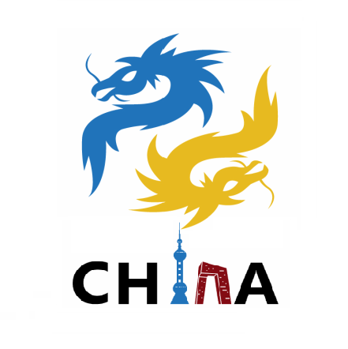

# PyCon China Design

这个仓库用来保存 PyCon China 相关的设计文件和素材。

## 设计师

目前 PyCon China 的设计师是[吴妙璇](https://mxuan.zcool.com.cn/)（M_Xuan），负责 PyCon China 2017 至今的 PyCon China 线上线下各类物料的设计，你可以在作品集《[PyConChina大会设计2017-2019](https://www.zcool.com.cn/work/ZNDM3NzAzMzY=.html)》看到她为 PyCon China 设计的所有作品。

## PyCon China Logo

主 logo：

包含文字的 logo：

目前包含文字的主 logo 是基于 PyConChina 2012 年的 logo 修改而来，原作者是陆卫锋 （Riku）。

## Logo 配色

主 logo 配色和 Python logo 配色一致，分别为 Lapis Lazuli（#306998）和 Sunglow（#FFD43B）。

黄：

- Name: Sunglow
- Hex: #FFD43B
- RGB: (255, 212, 59)
- CMYK: 0, 0.168, 0.768, 0

蓝：

- Name: Lapis Lazuli
- Hex: #306998
- RGB: (48, 105, 152)
- CMYK: 0.684, 0.309, 0, 0.403

## 贡献

如果你有更高质量的 logo 图片或相关设计文件，欢迎提交 PR 添加。如果你擅长设计，欢迎加入志愿者团队，详情请关注[大会官网](https://cn.pycon.org/)。
